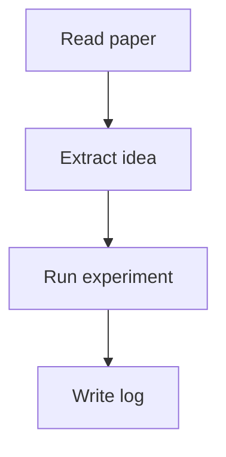

# Hexo 博客项目生成说明：`the-machine-log`

> 面向 Codex / AI 编程助手的项目 README。  
> 目标：生成一个 Hexo 博客主题，用于记录计算机研究生阶段的学习、论文阅读、课程笔记、项目复盘与研究日志。  
> 视觉灵感来自《疑犯追踪》（Person of Interest）中 “The Machine” 的监控界面、终端感、暗色 UI、数据流、识别框与时间线风格，但不要直接使用剧集 Logo、截图、专有图形、台词或音效素材。

---

## 1. 项目目标

请为我生成一个完整可运行的 Hexo 博客项目，主题名称为：

```txt
the-machine-log
```

博客定位：

- 计算机研究生学习记录
- 论文阅读笔记
- 算法 / 系统 / AI / 安全 / 工程实践总结
- 项目日志与实验记录
- 个人知识库沉淀

整体风格关键词：

```txt
dark terminal / surveillance interface / The Machine inspired / cyber research log /
monospace typography / data stream / redacted text / timeline / code-first / academic
```

---

## 2. 技术栈要求

使用 Hexo 作为博客框架。

### 必选

- Hexo
- 自定义 Hexo 主题：`themes/the-machine-log`
- 支持 Markdown 文章
- 支持代码高亮
- 支持数学公式
- 支持文章目录 TOC
- 支持标签、分类、归档
- 支持响应式布局
- 支持深色主题
- 支持搜索
- 支持 RSS
- 支持 Mermaid 图表

### 推荐依赖

可以使用或配置以下插件：

```bash
hexo-generator-searchdb
hexo-renderer-marked
hexo-renderer-pug
hexo-renderer-stylus
hexo-filter-mathjax
hexo-generator-feed
hexo-generator-sitemap
hexo-abbrlink
```

如果选择 EJS / Pug / Nunjucks / Stylus / SCSS 均可，但请保持结构清晰、容易维护。

---

## 3. 视觉设计要求

整体界面应该像一个“研究日志终端”或“机器观察系统”，但必须是原创设计。

### 颜色

主色：

```txt
背景：#05070A / #080B10
面板：#0D1117 / #101620
边框：#1F6FEB / #2EA043 / rgba(110, 231, 183, 0.35)
文字：#D7E0EA
弱文字：#7D8590
强调绿：#39FF88
警示橙：#FFB020
危险红：#FF4D4D
代码蓝：#58A6FF
```

### 字体

- 标题和 UI：优先使用系统无衬线字体
- 代码和信息面板：使用等宽字体，例如：

```css
font-family: "JetBrains Mono", "Fira Code", "SFMono-Regular", Consolas, monospace;
```

### 视觉元素

需要实现以下原创风格元素：

1. **扫描线背景**
   - 页面背景上有非常轻微的横向扫描线
   - 不要影响正文阅读

2. **数据网格**
   - 背景可以有低透明度网格线
   - 类似终端监控界面的坐标感

3. **识别框 / 面板边角**
   - 卡片、文章列表、侧边栏可以有类似 HUD 的角标
   - 使用 CSS 边框实现，不要使用剧集素材

4. **状态栏**
   - 顶部或侧边显示：
     - `SYSTEM ONLINE`
     - 当前页面路径
     - 当前时间
     - 文章数量 / 分类数量 / 标签数量
   - 可以通过前端 JavaScript 实时刷新时间

5. **红acted 文本效果**
   - 支持 `.redacted` 样式
   - 显示为被黑条遮挡的文字
   - 鼠标悬停可略微显示提示，但不要破坏阅读体验

6. **终端式文章卡片**
   - 每篇文章像一条系统记录：
     - 日期
     - 标题
     - 标签
     - 摘要
     - 阅读时长
     - 状态标识，例如 `ARCHIVED` / `ACTIVE` / `RESEARCH`

7. **时间线归档**
   - 归档页使用纵向时间线
   - 年份、月份、文章条目分层展示

8. **代码块风格**
   - 代码块像终端窗口
   - 顶部显示文件名或语言
   - 支持复制按钮
   - 行内代码要清晰

---

## 4. 页面要求

请至少实现以下页面模板：

```txt
首页
文章详情页
归档页
分类页
标签页
关于页
搜索页
404 页
```

### 首页

首页结构：

1. 顶部 Hero 区域
   - 标题：`THE MACHINE LOG`
   - 副标题：`A research log for systems, algorithms, AI and everything in between.`
   - 显示伪终端输出，例如：

```txt
> boot sequence initialized
> identity: computer science graduate student
> status: learning / researching / building
> archive access granted
```

2. 最近文章列表
3. 分类快捷入口
4. 研究方向卡片，例如：
   - Algorithms
   - Distributed Systems
   - Artificial Intelligence
   - Security
   - Programming Languages
   - Engineering Notes

### 文章详情页

必须包含：

- 文章标题
- 创建时间
- 更新时间
- 分类
- 标签
- 阅读时长
- 目录 TOC
- 正文
- 上一篇 / 下一篇
- 返回顶部按钮

文章页面风格像“系统档案”：

```txt
CASE FILE: <post title>
STATUS: ACTIVE
CLASSIFICATION: LEARNING RECORD
```

### 关于页

生成一个适合计算机研究生博客的默认 About 页面，内容可包括：

- 我是谁
- 为什么写这个博客
- 研究兴趣
- 技术栈
- 学习方法
- 联系方式占位符

不要写得太夸张，保持克制、理性、研究型风格。

### 404 页

风格参考系统错误页：

```txt
SIGNAL LOST
The requested archive does not exist.
Return to index.
```

---

## 5. 内容组织建议

请生成以下默认分类：

```txt
Algorithms
Systems
AI
Security
Math
Engineering
Reading Notes
Research Log
```

请生成以下默认标签：

```txt
paper-reading
leetcode
distributed-system
machine-learning
deep-learning
operating-system
compiler
database
network
security
rust
cpp
python
linux
experiment
```

请生成几篇示例文章，用来测试主题效果：

```txt
source/_posts/hello-machine-log.md
source/_posts/paper-reading-template.md
source/_posts/algorithm-note-template.md
source/_posts/system-design-note-template.md
source/_posts/research-weekly-log-template.md
```

---

## 6. Markdown 文章模板

请为我生成几种文章模板。

### 论文阅读模板

```markdown
---
title: Paper Reading - <Paper Title>
date:
updated:
categories:
  - Reading Notes
tags:
  - paper-reading
  - <topic>
status: research
summary:
---

## Metadata

- Paper:
- Authors:
- Venue:
- Year:
- Link:
- Code:
- Keywords:

## One-sentence Summary

## Motivation

## Key Idea

## Method

## Experiments

## Strengths

## Weaknesses

## Questions

## Related Work

## Takeaways

## Future Reading
```

### 算法笔记模板

```markdown
---
title: Algorithm Note - <Topic>
date:
updated:
categories:
  - Algorithms
tags:
  - algorithm
  - leetcode
status: active
summary:
---

## Problem

## Intuition

## Algorithm

## Correctness

## Complexity

## Implementation

```cpp
// code here
```

## Pitfalls

## Related Problems
```

### 研究周报模板

```markdown
---
title: Research Weekly Log - Week <N>
date:
updated:
categories:
  - Research Log
tags:
  - experiment
  - weekly-log
status: active
summary:
---

## This Week

## What I Read

## What I Built

## Experiments

## Problems

## Next Week

## Random Notes
```

---

## 7. 主题目录结构

请生成类似下面的结构：

```txt
themes/the-machine-log/
  _config.yml
  layout/
    layout.ejs
    index.ejs
    post.ejs
    archive.ejs
    category.ejs
    tag.ejs
    page.ejs
    search.ejs
    404.ejs
    partial/
      head.ejs
      header.ejs
      footer.ejs
      sidebar.ejs
      post-card.ejs
      toc.ejs
      pagination.ejs
      scripts.ejs
  source/
    css/
      main.styl
      variables.styl
      components.styl
      post.styl
      responsive.styl
    js/
      main.js
      search.js
      code-copy.js
      clock.js
    images/
```

如果使用 Pug / Nunjucks / SCSS，也可以调整，但请保持模块化。

---

## 8. 功能细节

### 8.1 搜索

请使用本地搜索。

期望效果：

- 搜索页或弹窗搜索
- 输入关键词后实时过滤
- 支持标题、正文、标签、分类搜索
- 搜索结果显示标题、摘要、日期、标签

### 8.2 TOC

文章页右侧显示目录。

要求：

- 桌面端固定在右侧
- 移动端折叠
- 当前阅读位置高亮
- 点击平滑滚动

### 8.3 代码复制

每个代码块右上角有复制按钮。

复制成功后显示：

```txt
COPIED
```

### 8.4 阅读时间

根据正文长度估算阅读时间。

显示格式：

```txt
READ TIME: 6 MIN
```

### 8.5 文章状态

支持 front-matter 字段：

```yaml
status: active
```

可选值：

```txt
active
archived
research
draft
```

不同状态显示不同 badge。

### 8.6 Mermaid

支持在文章中写：

````markdown

````

### 8.7 数学公式

支持行内和块级公式：

```markdown
Inline: $O(n \log n)$

Block:

$$
L(\theta) = \frac{1}{n}\sum_{i=1}^{n}\ell(f_\theta(x_i), y_i)
$$
```

---

## 9. 动效要求

动效要克制，不要影响阅读。

可以实现：

- 页面加载时轻微 fade-in
- 卡片 hover 时边框发光
- Hero 区域伪终端逐行出现
- 鼠标悬停时显示轻微扫描效果
- 当前导航项高亮

避免：

- 大量闪烁
- 过度赛博朋克
- 背景动画太抢眼
- 影响性能的复杂动画

---

## 10. 可访问性与可读性

请特别注意：

- 正文阅读优先
- 不要让装饰元素盖过内容
- 正文字号至少 16px
- 行高 1.7 左右
- 代码块可横向滚动
- 移动端导航可折叠
- 颜色对比度足够
- 不依赖颜色传达全部信息

---

## 11. Hexo 配置要求

根目录 `_config.yml` 中需要配置：

```yaml
title: THE MACHINE LOG
subtitle: A research log for systems, algorithms, AI and everything in between.
description: Notes from a computer science graduate student.
author: Your Name
language: zh-CN
timezone: Asia/Shanghai

theme: the-machine-log

permalink: posts/:abbrlink/
```

主题 `_config.yml` 中需要支持：

```yaml
menu:
  Home: /
  Archives: /archives/
  Categories: /categories/
  Tags: /tags/
  Search: /search/
  About: /about/

social:
  github:
  email:
  google_scholar:

profile:
  name: Your Name
  role: Computer Science Graduate Student
  status: Learning / Researching / Building
  location:

features:
  search: true
  toc: true
  code_copy: true
  mermaid: true
  math: true
  rss: true
```

---

## 12. 生成任务清单

请按顺序完成：

1. 初始化 Hexo 项目
2. 安装必要依赖
3. 创建主题 `themes/the-machine-log`
4. 编写主题布局模板
5. 编写主题样式
6. 编写前端交互脚本
7. 配置搜索、RSS、数学公式、Mermaid、代码高亮
8. 创建默认页面：
   - About
   - Search
   - 404
9. 创建示例文章和模板文章
10. 确保 `hexo clean && hexo generate && hexo server` 可运行
11. 在 README 中补充本地运行说明
12. 检查移动端布局

---

## 13. 本地运行命令

最终项目应该可以通过以下方式运行：

```bash
npm install
npx hexo clean
npx hexo generate
npx hexo server
```

访问：

```txt
http://localhost:4000
```

---

## 14. 验收标准

生成完成后，请确保：

- 首页可正常访问
- 文章页可正常访问
- 归档、分类、标签页可正常访问
- 搜索功能可用
- 代码块复制功能可用
- TOC 可用
- Mermaid 图可渲染
- 数学公式可渲染
- 移动端可正常阅读
- 没有明显控制台错误
- 没有使用《疑犯追踪》的官方图片、Logo、剧照或未经授权素材
- 主题整体呈现“监控系统 / 研究日志 / 暗色终端”的原创视觉风格

---

## 15. 额外要求

请保持代码清晰、注释适量，并避免把所有逻辑写在一个文件里。

最终输出时，请说明：

1. 项目结构
2. 安装了哪些依赖
3. 如何运行
4. 如何写一篇新文章
5. 如何修改个人信息
6. 如何部署到 GitHub Pages

---

## 16. 推荐的最终 README 补充内容

请在生成后的项目 README 中加入下面几节：

```markdown
## Writing Workflow

## Post Front Matter

## Theme Configuration

## Deployment

## Customization

## License
```

License 可以默认使用 MIT。

---

## 17. 风格边界

这个主题可以受到《疑犯追踪》中 The Machine UI 的启发，但必须是原创实现：

允许：

- 暗色监控界面感
- 数据流、网格、状态面板
- 终端、日志、扫描线、识别框风格
- “系统档案”“研究记录”的抽象设计语言

不允许：

- 直接复制剧集画面
- 使用剧集 Logo
- 使用官方截图
- 复刻具体 UI 画面到高度相似
- 使用剧集台词或音效

目标不是做同人复刻，而是做一个适合长期写作的、克制的、学术型、工程师风格的 Hexo 博客主题。
