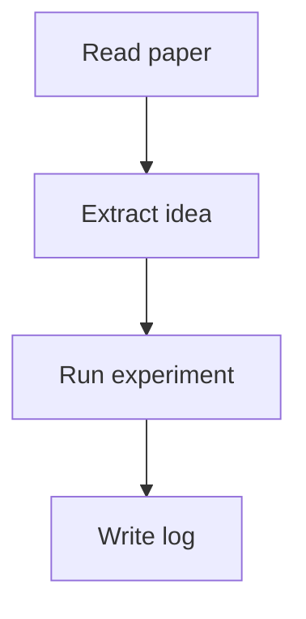

## Boot Record

> boot sequence initialized
> identity: computer science graduate student
> status: learning / researching / building
> archive access granted

这是第一篇测试文章，用于验证主题在文章页中的元信息、目录、代码块、公式和图表渲染。

## Quick Code

```python
from collections import Counter

text = "the machine log"
print(Counter(text.split()))
```

## Mermaid Test



## Math Test

Inline: $O(n \log n)$

$$
L(\theta) = \frac{1}{n}\sum_{i=1}^{n}\ell(f_\theta(x_i), y_i)
$$

## Redacted Example

这是一段 <span class="redacted">sensitive internal draft text</span> 的样式演示。
